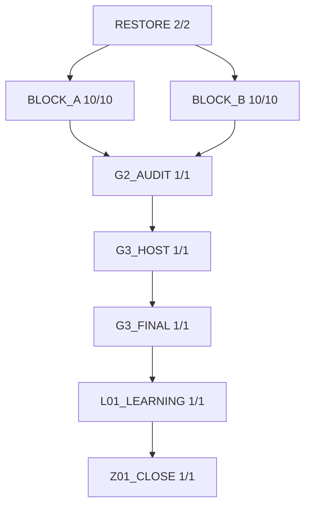

# 火柴図（GENERATED）

```mermaid
flowchart TD
  N0["RESTORE 2/2"]
  N1["BLOCK_A 10/10"]
  N2["BLOCK_B 10/10"]
  N3["G2_AUDIT 1/1"]
  N4["G3_HOST 1/1"]
  N5["G3_FINAL 1/1"]
  N6["L01_LEARNING 1/1"]
  N7["Z01_CLOSE 1/1"]
  N1 --> N3
  N2 --> N3
  N3 --> N4
  N5 --> N6
  N4 --> N5
  N6 --> N7
  N0 --> N1
  N0 --> N2
```

現在の経路: material / 次ノード: — / DONE

各ブロック内のノード・担当・失効・依存は CURRENT_POSITION.md と snapshot.json を参照。
