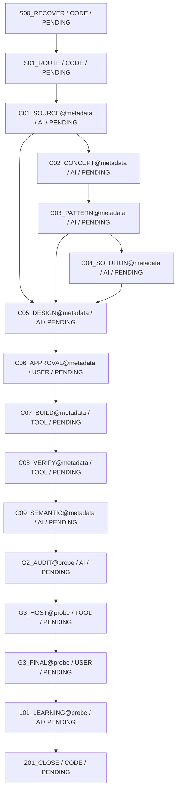

# ブロック火柴図（GENERATED）

台帳HEAD: `797b5b357878b3ee9723f62faf0c7a5c833ac64d87cc97d4bf493932f946c0f2`

```mermaid
flowchart TD
  N0["S00_RECOVER / CODE / PENDING"]
  N1["S01_ROUTE / CODE / PENDING"]
  N2["C01_SOURCE@metadata / AI / PENDING"]
  N3["C02_CONCEPT@metadata / AI / PENDING"]
  N4["C03_PATTERN@metadata / AI / PENDING"]
  N5["C04_SOLUTION@metadata / AI / PENDING"]
  N6["C05_DESIGN@metadata / AI / PENDING"]
  N7["C06_APPROVAL@metadata / USER / PENDING"]
  N8["C07_BUILD@metadata / TOOL / PENDING"]
  N9["C08_VERIFY@metadata / TOOL / PENDING"]
  N10["C09_SEMANTIC@metadata / AI / PENDING"]
  N11["G2_AUDIT@probe / AI / PENDING"]
  N12["G3_HOST@probe / TOOL / PENDING"]
  N13["G3_FINAL@probe / USER / PENDING"]
  N14["L01_LEARNING@probe / AI / PENDING"]
  N15["Z01_CLOSE / CODE / PENDING"]
  N2 --> N3
  N2 --> N6
  N3 --> N4
  N4 --> N5
  N4 --> N6
  N5 --> N6
  N6 --> N7
  N7 --> N8
  N8 --> N9
  N9 --> N10
  N10 --> N11
  N11 --> N12
  N13 --> N14
  N12 --> N13
  N14 --> N15
  N0 --> N1
  N1 --> N2
```

現在: — / BLOCKED
