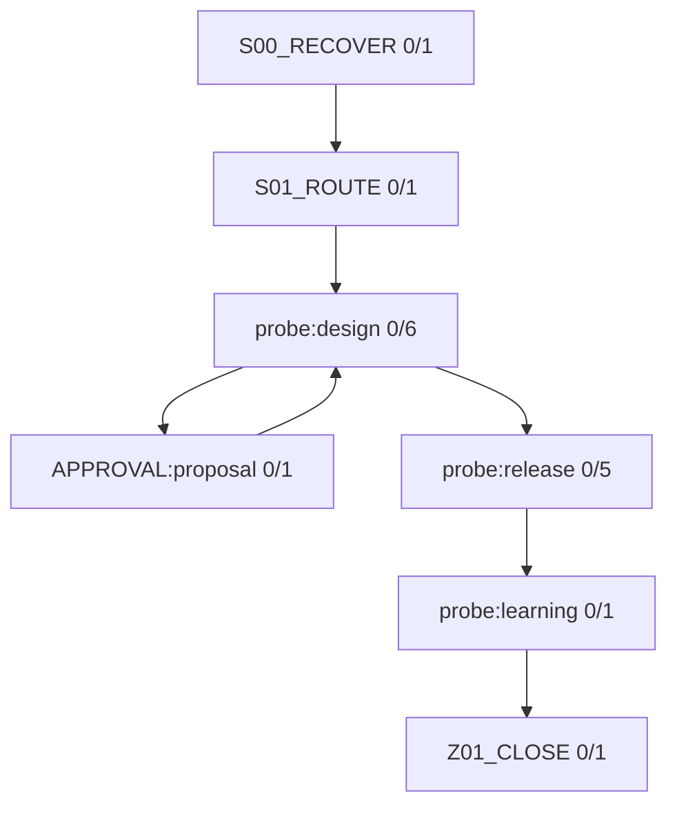

# 全体火柴図（GENERATED）

台帳HEAD: `797b5b357878b3ee9723f62faf0c7a5c833ac64d87cc97d4bf493932f946c0f2`

```mermaid
flowchart TD
  N0["S00_RECOVER 0/1"]
  N1["S01_ROUTE 0/1"]
  N2["probe:design 0/6"]
  N3["APPROVAL:proposal 0/1"]
  N4["probe:release 0/5"]
  N5["probe:learning 0/1"]
  N6["Z01_CLOSE 0/1"]
  N3 --> N2
  N0 --> N1
  N1 --> N2
  N2 --> N3
  N2 --> N4
  N5 --> N6
  N4 --> N5
```

現在: — / BLOCKED
保留・修正queue: 6
関連修正Work: —
差戻しは再分析・失効・子Workの台帳イベントで記録し、実行依存へ循環を入れない。
