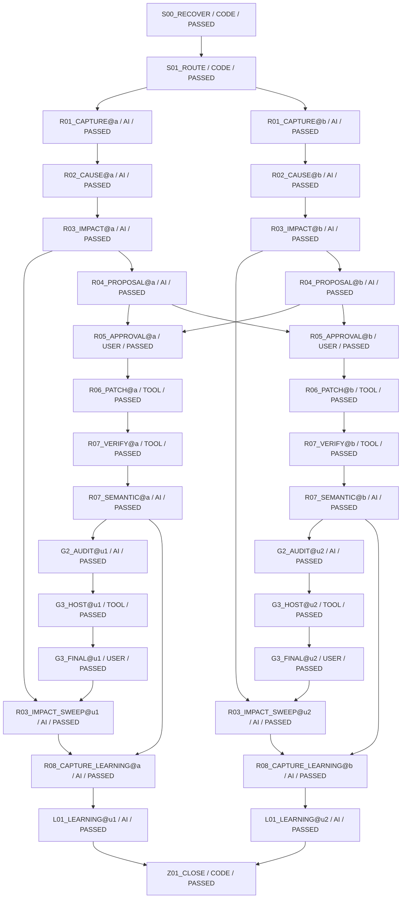

# ブロック火柴図（GENERATED）

台帳HEAD: `e9a3b6bcf1281e1177fb05ea4659bed0da3b433742609171eae763a5805900d1`

```mermaid
flowchart TD
  N0["S00_RECOVER / CODE / PASSED"]
  N1["S01_ROUTE / CODE / PASSED"]
  N2["R01_CAPTURE@a / AI / PASSED"]
  N3["R02_CAUSE@a / AI / PASSED"]
  N4["R03_IMPACT@a / AI / PASSED"]
  N5["R04_PROPOSAL@a / AI / PASSED"]
  N6["R05_APPROVAL@a / USER / PASSED"]
  N7["R06_PATCH@a / TOOL / PASSED"]
  N8["R07_VERIFY@a / TOOL / PASSED"]
  N9["R07_SEMANTIC@a / AI / PASSED"]
  N10["R01_CAPTURE@b / AI / PASSED"]
  N11["R02_CAUSE@b / AI / PASSED"]
  N12["R03_IMPACT@b / AI / PASSED"]
  N13["R04_PROPOSAL@b / AI / PASSED"]
  N14["R05_APPROVAL@b / USER / PASSED"]
  N15["R06_PATCH@b / TOOL / PASSED"]
  N16["R07_VERIFY@b / TOOL / PASSED"]
  N17["R07_SEMANTIC@b / AI / PASSED"]
  N18["G2_AUDIT@u1 / AI / PASSED"]
  N19["G3_HOST@u1 / TOOL / PASSED"]
  N20["G3_FINAL@u1 / USER / PASSED"]
  N21["R03_IMPACT_SWEEP@u1 / AI / PASSED"]
  N22["R08_CAPTURE_LEARNING@a / AI / PASSED"]
  N23["L01_LEARNING@u1 / AI / PASSED"]
  N24["G2_AUDIT@u2 / AI / PASSED"]
  N25["G3_HOST@u2 / TOOL / PASSED"]
  N26["G3_FINAL@u2 / USER / PASSED"]
  N27["R03_IMPACT_SWEEP@u2 / AI / PASSED"]
  N28["R08_CAPTURE_LEARNING@b / AI / PASSED"]
  N29["L01_LEARNING@u2 / AI / PASSED"]
  N30["Z01_CLOSE / CODE / PASSED"]
  N18 --> N19
  N24 --> N25
  N20 --> N21
  N26 --> N27
  N19 --> N20
  N25 --> N26
  N23 --> N30
  N29 --> N30
  N2 --> N3
  N10 --> N11
  N3 --> N4
  N11 --> N12
  N4 --> N21
  N4 --> N5
  N12 --> N27
  N12 --> N13
  N21 --> N22
  N27 --> N28
  N5 --> N6
  N5 --> N14
  N13 --> N6
  N13 --> N14
  N6 --> N7
  N14 --> N15
  N7 --> N8
  N15 --> N16
  N9 --> N18
  N9 --> N22
  N17 --> N24
  N17 --> N28
  N8 --> N9
  N16 --> N17
  N22 --> N23
  N28 --> N29
  N0 --> N1
  N1 --> N2
  N1 --> N10
```

現在: — / DONE
