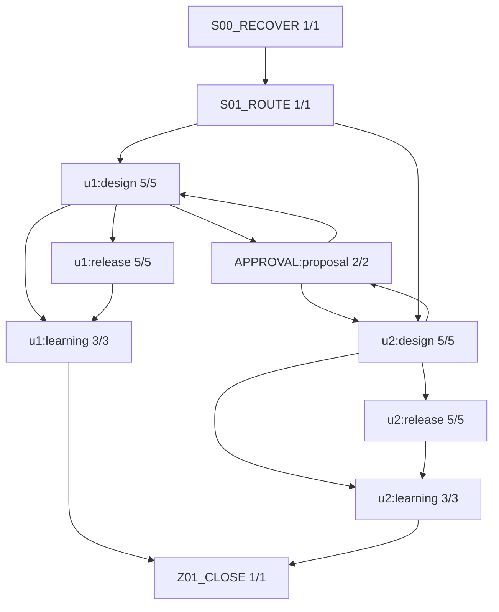

# 全体火柴図（GENERATED）

台帳HEAD: `e750d80eee558c704aed21af45ddda228e37b0e365eb223a491c9df0877c5837`

```mermaid
flowchart TD
  N0["S00_RECOVER 1/1"]
  N1["S01_ROUTE 1/1"]
  N2["u1:design 5/5"]
  N3["APPROVAL:proposal 2/2"]
  N4["u1:release 5/5"]
  N5["u2:design 5/5"]
  N6["u2:release 5/5"]
  N7["u1:learning 3/3"]
  N8["u2:learning 3/3"]
  N9["Z01_CLOSE 1/1"]
  N3 --> N2
  N3 --> N5
  N0 --> N1
  N1 --> N2
  N1 --> N5
  N2 --> N3
  N2 --> N7
  N2 --> N4
  N7 --> N9
  N4 --> N7
  N5 --> N3
  N5 --> N8
  N5 --> N6
  N8 --> N9
  N6 --> N8
```

現在: — / DONE
保留・修正queue: 0
関連修正Work: —
差戻しは再分析・失効・子Workの台帳イベントで記録し、実行依存へ循環を入れない。
