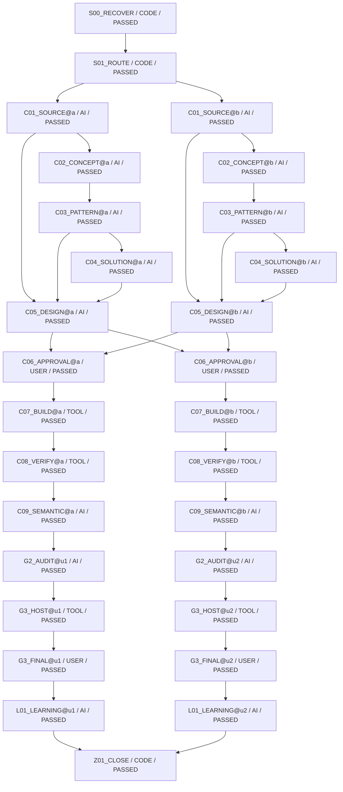

# ブロック火柴図（GENERATED）

台帳HEAD: `3fdc6769d007a84b9cdc26871be8879b6d30a0bc77e3b7ccde865b0d39e2806a`

```mermaid
flowchart TD
  N0["S00_RECOVER / CODE / PASSED"]
  N1["S01_ROUTE / CODE / PASSED"]
  N2["C01_SOURCE@a / AI / PASSED"]
  N3["C02_CONCEPT@a / AI / PASSED"]
  N4["C03_PATTERN@a / AI / PASSED"]
  N5["C04_SOLUTION@a / AI / PASSED"]
  N6["C05_DESIGN@a / AI / PASSED"]
  N7["C06_APPROVAL@a / USER / PASSED"]
  N8["C07_BUILD@a / TOOL / PASSED"]
  N9["C08_VERIFY@a / TOOL / PASSED"]
  N10["C09_SEMANTIC@a / AI / PASSED"]
  N11["C01_SOURCE@b / AI / PASSED"]
  N12["C02_CONCEPT@b / AI / PASSED"]
  N13["C03_PATTERN@b / AI / PASSED"]
  N14["C04_SOLUTION@b / AI / PASSED"]
  N15["C05_DESIGN@b / AI / PASSED"]
  N16["C06_APPROVAL@b / USER / PASSED"]
  N17["C07_BUILD@b / TOOL / PASSED"]
  N18["C08_VERIFY@b / TOOL / PASSED"]
  N19["C09_SEMANTIC@b / AI / PASSED"]
  N20["G2_AUDIT@u1 / AI / PASSED"]
  N21["G3_HOST@u1 / TOOL / PASSED"]
  N22["G3_FINAL@u1 / USER / PASSED"]
  N23["L01_LEARNING@u1 / AI / PASSED"]
  N24["G2_AUDIT@u2 / AI / PASSED"]
  N25["G3_HOST@u2 / TOOL / PASSED"]
  N26["G3_FINAL@u2 / USER / PASSED"]
  N27["L01_LEARNING@u2 / AI / PASSED"]
  N28["Z01_CLOSE / CODE / PASSED"]
  N2 --> N3
  N2 --> N6
  N11 --> N12
  N11 --> N15
  N3 --> N4
  N12 --> N13
  N4 --> N5
  N4 --> N6
  N13 --> N14
  N13 --> N15
  N5 --> N6
  N14 --> N15
  N6 --> N7
  N6 --> N16
  N15 --> N7
  N15 --> N16
  N7 --> N8
  N16 --> N17
  N8 --> N9
  N17 --> N18
  N9 --> N10
  N18 --> N19
  N10 --> N20
  N19 --> N24
  N20 --> N21
  N24 --> N25
  N22 --> N23
  N26 --> N27
  N21 --> N22
  N25 --> N26
  N23 --> N28
  N27 --> N28
  N0 --> N1
  N1 --> N2
  N1 --> N11
```

現在: — / DONE
