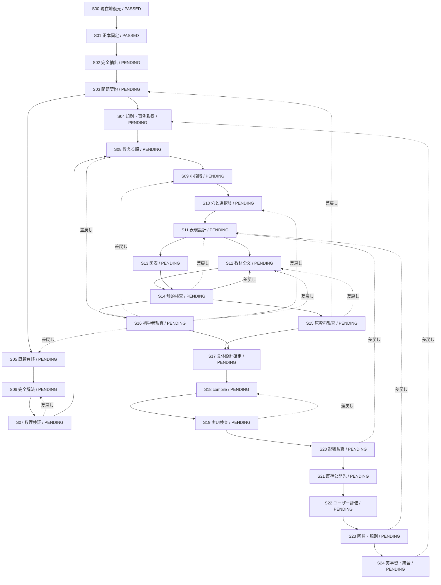

# 制作火柴図（台帳から生成）

```mermaid
flowchart TD
  S00["S00 現在地復元 / PASSED"]
  S01["S01 正本固定 / PASSED"]
  S00 --> S01
  S02["S02 完全抽出 / PENDING"]
  S01 --> S02
  S03["S03 問題契約 / PENDING"]
  S02 --> S03
  S04["S04 規則・事例取得 / PENDING"]
  S03 --> S04
  S05["S05 既習台帳 / PENDING"]
  S03 --> S05
  S06["S06 完全解法 / PENDING"]
  S05 --> S06
  S07["S07 数理検証 / PENDING"]
  S06 --> S07
  S07 -. 差戻し .-> S06
  S08["S08 教える順 / PENDING"]
  S04 --> S08
  S07 --> S08
  S09["S09 小段階 / PENDING"]
  S08 --> S09
  S10["S10 穴と選択肢 / PENDING"]
  S09 --> S10
  S11["S11 表現設計 / PENDING"]
  S10 --> S11
  S12["S12 教材全文 / PENDING"]
  S11 --> S12
  S13["S13 図表 / PENDING"]
  S11 --> S13
  S14["S14 静的検査 / PENDING"]
  S12 --> S14
  S13 --> S14
  S14 -. 差戻し .-> S11
  S14 -. 差戻し .-> S12
  S15["S15 原資料監査 / PENDING"]
  S14 --> S15
  S15 -. 差戻し .-> S03
  S15 -. 差戻し .-> S12
  S16["S16 初学者監査 / PENDING"]
  S14 --> S16
  S16 -. 差戻し .-> S05
  S16 -. 差戻し .-> S08
  S16 -. 差戻し .-> S09
  S16 -. 差戻し .-> S10
  S16 -. 差戻し .-> S12
  S17["S17 具体設計確定 / PENDING"]
  S15 --> S17
  S16 --> S17
  S18["S18 compile / PENDING"]
  S17 --> S18
  S19["S19 実UI検査 / PENDING"]
  S18 --> S19
  S19 -. 差戻し .-> S18
  S20["S20 影響監査 / PENDING"]
  S19 --> S20
  S20 -. 差戻し .-> S11
  S21["S21 既存公開先 / PENDING"]
  S20 --> S21
  S22["S22 ユーザー評価 / PENDING"]
  S21 --> S22
  S23["S23 回帰・規則 / PENDING"]
  S22 --> S23
  S23 -. 差戻し .-> S11
  S24["S24 実学習・統合 / PENDING"]
  S23 --> S24
  S24 -. 差戻し .-> S04
```
