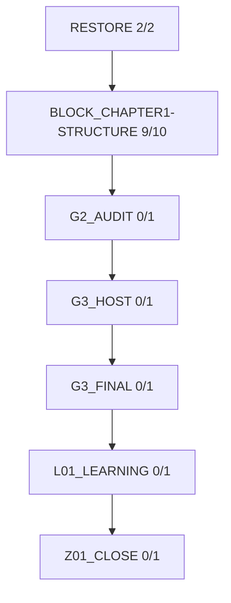

# 火柴図（GENERATED）

```mermaid
flowchart TD
  N0["RESTORE 2/2"]
  N1["BLOCK_CHAPTER1-STRUCTURE 9/10"]
  N2["G2_AUDIT 0/1"]
  N3["G3_HOST 0/1"]
  N4["G3_FINAL 0/1"]
  N5["L01_LEARNING 0/1"]
  N6["Z01_CLOSE 0/1"]
  N1 --> N2
  N2 --> N3
  N4 --> N5
  N3 --> N4
  N5 --> N6
  N0 --> N1
```

現在の経路: material / 次ノード: G1_VISUAL@CHAPTER1-STRUCTURE / WAITING

各ブロック内のノード・担当・失効・依存は CURRENT_POSITION.md と snapshot.json を参照。
