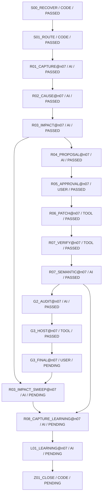

# ブロック火柴図（GENERATED）

台帳HEAD: `4950739b91cc7397f7deffbcd7119d8624c5585bc8b3390636a9282b14173ac1`

```mermaid
flowchart TD
  N0["S00_RECOVER / CODE / PASSED"]
  N1["S01_ROUTE / CODE / PASSED"]
  N2["R01_CAPTURE@n07 / AI / PASSED"]
  N3["R02_CAUSE@n07 / AI / PASSED"]
  N4["R03_IMPACT@n07 / AI / PASSED"]
  N5["R04_PROPOSAL@n07 / AI / PASSED"]
  N6["R05_APPROVAL@n07 / USER / PASSED"]
  N7["R06_PATCH@n07 / TOOL / PASSED"]
  N8["R07_VERIFY@n07 / TOOL / PASSED"]
  N9["R07_SEMANTIC@n07 / AI / PASSED"]
  N10["G2_AUDIT@n07 / AI / PASSED"]
  N11["G3_HOST@n07 / TOOL / PASSED"]
  N12["G3_FINAL@n07 / USER / PENDING"]
  N13["R03_IMPACT_SWEEP@n07 / AI / PENDING"]
  N14["R08_CAPTURE_LEARNING@n07 / AI / PENDING"]
  N15["L01_LEARNING@n07 / AI / PENDING"]
  N16["Z01_CLOSE / CODE / PENDING"]
  N10 --> N11
  N12 --> N13
  N11 --> N12
  N15 --> N16
  N2 --> N3
  N3 --> N4
  N4 --> N13
  N4 --> N5
  N13 --> N14
  N5 --> N6
  N6 --> N7
  N7 --> N8
  N9 --> N10
  N9 --> N14
  N8 --> N9
  N14 --> N15
  N0 --> N1
  N1 --> N2
```

現在: G3_FINAL@n07 / WAITING
