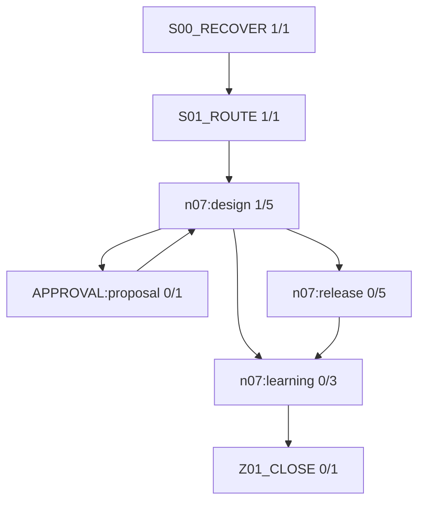

# 全体火柴図（GENERATED）

台帳HEAD: `94a5ec052a938ba2de45c6e31c28cd06311991d820513f374dd79d06c8d21935`

```mermaid
flowchart TD
  N0["S00_RECOVER 1/1"]
  N1["S01_ROUTE 1/1"]
  N2["n07:design 1/5"]
  N3["APPROVAL:proposal 0/1"]
  N4["n07:release 0/5"]
  N5["n07:learning 0/3"]
  N6["Z01_CLOSE 0/1"]
  N3 --> N2
  N0 --> N1
  N1 --> N2
  N2 --> N3
  N2 --> N5
  N2 --> N4
  N5 --> N6
  N4 --> N5
```

現在: R02_CAUSE@n07 / BLOCKED
保留・修正queue: 7
関連修正Work: —
差戻しは再分析・失効・子Workの台帳イベントで記録し、実行依存へ循環を入れない。
