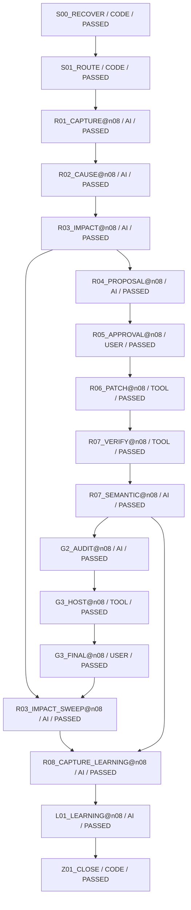

# ブロック火柴図（GENERATED）

台帳HEAD: `63440b7933a942927209a5f930b8644307d2b6b1dfd1c2bc312726d5a1f5d424`

```mermaid
flowchart TD
  N0["S00_RECOVER / CODE / PASSED"]
  N1["S01_ROUTE / CODE / PASSED"]
  N2["R01_CAPTURE@n08 / AI / PASSED"]
  N3["R02_CAUSE@n08 / AI / PASSED"]
  N4["R03_IMPACT@n08 / AI / PASSED"]
  N5["R04_PROPOSAL@n08 / AI / PASSED"]
  N6["R05_APPROVAL@n08 / USER / PASSED"]
  N7["R06_PATCH@n08 / TOOL / PASSED"]
  N8["R07_VERIFY@n08 / TOOL / PASSED"]
  N9["R07_SEMANTIC@n08 / AI / PASSED"]
  N10["G2_AUDIT@n08 / AI / PASSED"]
  N11["G3_HOST@n08 / TOOL / PASSED"]
  N12["G3_FINAL@n08 / USER / PASSED"]
  N13["R03_IMPACT_SWEEP@n08 / AI / PASSED"]
  N14["R08_CAPTURE_LEARNING@n08 / AI / PASSED"]
  N15["L01_LEARNING@n08 / AI / PASSED"]
  N16["Z01_CLOSE / CODE / PASSED"]
  N10 --> N11
  N12 --> N13
  N11 --> N12
  N15 --> N16
  N2 --> N3
  N3 --> N4
  N4 --> N13
  N4 --> N5
  N13 --> N14
  N5 --> N6
  N6 --> N7
  N7 --> N8
  N9 --> N10
  N9 --> N14
  N8 --> N9
  N14 --> N15
  N0 --> N1
  N1 --> N2
```

現在: — / DONE
