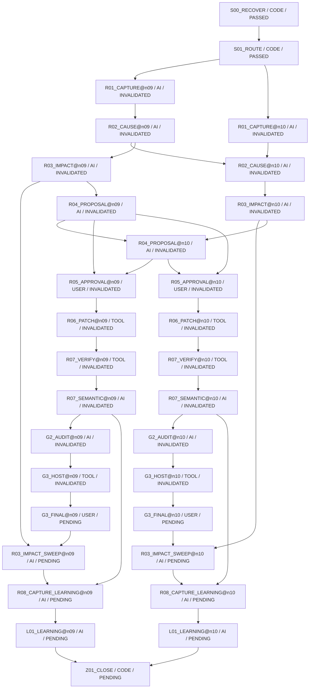

# ブロック火柴図（GENERATED）

台帳HEAD: `280e28e46a25a08d38384ba9ab708fec368e44230047dfd0724bce5c2dfe3dc8`

```mermaid
flowchart TD
  N0["S00_RECOVER / CODE / PASSED"]
  N1["S01_ROUTE / CODE / PASSED"]
  N2["R01_CAPTURE@n09 / AI / INVALIDATED"]
  N3["R02_CAUSE@n09 / AI / INVALIDATED"]
  N4["R03_IMPACT@n09 / AI / INVALIDATED"]
  N5["R04_PROPOSAL@n09 / AI / INVALIDATED"]
  N6["R05_APPROVAL@n09 / USER / INVALIDATED"]
  N7["R06_PATCH@n09 / TOOL / INVALIDATED"]
  N8["R07_VERIFY@n09 / TOOL / INVALIDATED"]
  N9["R07_SEMANTIC@n09 / AI / INVALIDATED"]
  N10["R01_CAPTURE@n10 / AI / INVALIDATED"]
  N11["R02_CAUSE@n10 / AI / INVALIDATED"]
  N12["R03_IMPACT@n10 / AI / INVALIDATED"]
  N13["R04_PROPOSAL@n10 / AI / INVALIDATED"]
  N14["R05_APPROVAL@n10 / USER / INVALIDATED"]
  N15["R06_PATCH@n10 / TOOL / INVALIDATED"]
  N16["R07_VERIFY@n10 / TOOL / INVALIDATED"]
  N17["R07_SEMANTIC@n10 / AI / INVALIDATED"]
  N18["G2_AUDIT@n09 / AI / INVALIDATED"]
  N19["G3_HOST@n09 / TOOL / INVALIDATED"]
  N20["G3_FINAL@n09 / USER / PENDING"]
  N21["R03_IMPACT_SWEEP@n09 / AI / PENDING"]
  N22["R08_CAPTURE_LEARNING@n09 / AI / PENDING"]
  N23["L01_LEARNING@n09 / AI / PENDING"]
  N24["G2_AUDIT@n10 / AI / INVALIDATED"]
  N25["G3_HOST@n10 / TOOL / INVALIDATED"]
  N26["G3_FINAL@n10 / USER / PENDING"]
  N27["R03_IMPACT_SWEEP@n10 / AI / PENDING"]
  N28["R08_CAPTURE_LEARNING@n10 / AI / PENDING"]
  N29["L01_LEARNING@n10 / AI / PENDING"]
  N30["Z01_CLOSE / CODE / PENDING"]
  N18 --> N19
  N24 --> N25
  N20 --> N21
  N26 --> N27
  N19 --> N20
  N25 --> N26
  N23 --> N30
  N29 --> N30
  N2 --> N3
  N10 --> N11
  N3 --> N11
  N3 --> N4
  N11 --> N12
  N4 --> N21
  N4 --> N5
  N12 --> N27
  N12 --> N13
  N21 --> N22
  N27 --> N28
  N5 --> N13
  N5 --> N6
  N5 --> N14
  N13 --> N6
  N13 --> N14
  N6 --> N7
  N14 --> N15
  N7 --> N8
  N15 --> N16
  N9 --> N18
  N9 --> N22
  N17 --> N24
  N17 --> N28
  N8 --> N9
  N16 --> N17
  N22 --> N23
  N28 --> N29
  N0 --> N1
  N1 --> N2
  N1 --> N10
```

現在: R01_CAPTURE@n09 / READY
