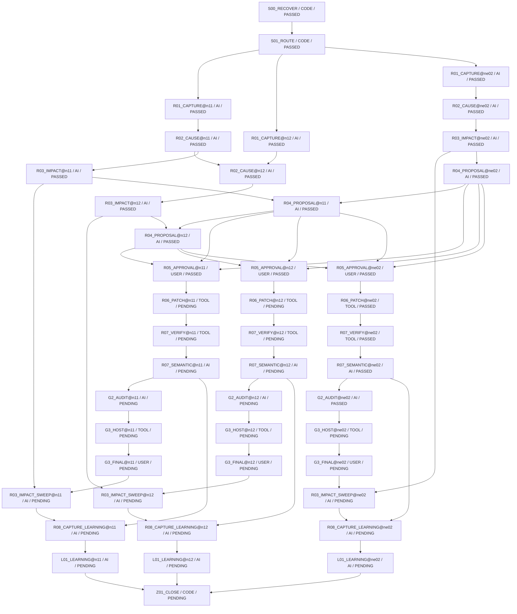

# ブロック火柴図（GENERATED）

台帳HEAD: `54556b9d7c8b8dc5719cc12f6a67887f86943cb605befbc56aaa452069f3da23`

```mermaid
flowchart TD
  N0["S00_RECOVER / CODE / PASSED"]
  N1["S01_ROUTE / CODE / PASSED"]
  N2["R01_CAPTURE@ne02 / AI / PASSED"]
  N3["R02_CAUSE@ne02 / AI / PASSED"]
  N4["R03_IMPACT@ne02 / AI / PASSED"]
  N5["R04_PROPOSAL@ne02 / AI / PASSED"]
  N6["R05_APPROVAL@ne02 / USER / PASSED"]
  N7["R06_PATCH@ne02 / TOOL / PASSED"]
  N8["R07_VERIFY@ne02 / TOOL / PASSED"]
  N9["R07_SEMANTIC@ne02 / AI / PASSED"]
  N10["R01_CAPTURE@n11 / AI / PASSED"]
  N11["R02_CAUSE@n11 / AI / PASSED"]
  N12["R03_IMPACT@n11 / AI / PASSED"]
  N13["R04_PROPOSAL@n11 / AI / PASSED"]
  N14["R05_APPROVAL@n11 / USER / PASSED"]
  N15["R06_PATCH@n11 / TOOL / PENDING"]
  N16["R07_VERIFY@n11 / TOOL / PENDING"]
  N17["R07_SEMANTIC@n11 / AI / PENDING"]
  N18["R01_CAPTURE@n12 / AI / PASSED"]
  N19["R02_CAUSE@n12 / AI / PASSED"]
  N20["R03_IMPACT@n12 / AI / PASSED"]
  N21["R04_PROPOSAL@n12 / AI / PASSED"]
  N22["R05_APPROVAL@n12 / USER / PASSED"]
  N23["R06_PATCH@n12 / TOOL / PENDING"]
  N24["R07_VERIFY@n12 / TOOL / PENDING"]
  N25["R07_SEMANTIC@n12 / AI / PENDING"]
  N26["G2_AUDIT@ne02 / AI / PASSED"]
  N27["G3_HOST@ne02 / TOOL / PENDING"]
  N28["G3_FINAL@ne02 / USER / PENDING"]
  N29["R03_IMPACT_SWEEP@ne02 / AI / PENDING"]
  N30["R08_CAPTURE_LEARNING@ne02 / AI / PENDING"]
  N31["L01_LEARNING@ne02 / AI / PENDING"]
  N32["G2_AUDIT@n11 / AI / PENDING"]
  N33["G3_HOST@n11 / TOOL / PENDING"]
  N34["G3_FINAL@n11 / USER / PENDING"]
  N35["R03_IMPACT_SWEEP@n11 / AI / PENDING"]
  N36["R08_CAPTURE_LEARNING@n11 / AI / PENDING"]
  N37["L01_LEARNING@n11 / AI / PENDING"]
  N38["G2_AUDIT@n12 / AI / PENDING"]
  N39["G3_HOST@n12 / TOOL / PENDING"]
  N40["G3_FINAL@n12 / USER / PENDING"]
  N41["R03_IMPACT_SWEEP@n12 / AI / PENDING"]
  N42["R08_CAPTURE_LEARNING@n12 / AI / PENDING"]
  N43["L01_LEARNING@n12 / AI / PENDING"]
  N44["Z01_CLOSE / CODE / PENDING"]
  N32 --> N33
  N38 --> N39
  N26 --> N27
  N34 --> N35
  N40 --> N41
  N28 --> N29
  N33 --> N34
  N39 --> N40
  N27 --> N28
  N37 --> N44
  N43 --> N44
  N31 --> N44
  N10 --> N11
  N18 --> N19
  N2 --> N3
  N11 --> N19
  N11 --> N12
  N19 --> N20
  N3 --> N4
  N12 --> N35
  N12 --> N13
  N20 --> N41
  N20 --> N21
  N4 --> N29
  N4 --> N5
  N35 --> N36
  N41 --> N42
  N29 --> N30
  N13 --> N21
  N13 --> N14
  N13 --> N22
  N13 --> N6
  N21 --> N14
  N21 --> N22
  N21 --> N6
  N5 --> N13
  N5 --> N14
  N5 --> N22
  N5 --> N6
  N14 --> N15
  N22 --> N23
  N6 --> N7
  N15 --> N16
  N23 --> N24
  N7 --> N8
  N17 --> N32
  N17 --> N36
  N25 --> N38
  N25 --> N42
  N9 --> N26
  N9 --> N30
  N16 --> N17
  N24 --> N25
  N8 --> N9
  N36 --> N37
  N42 --> N43
  N30 --> N31
  N0 --> N1
  N1 --> N10
  N1 --> N18
  N1 --> N2
```

現在: — / BLOCKED
