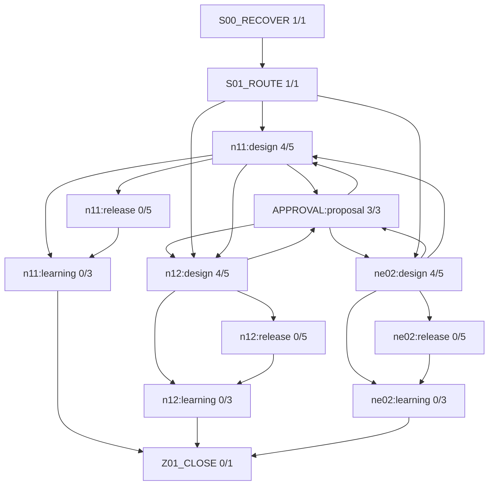

# 全体火柴図（GENERATED）

台帳HEAD: `082368ed1147e8a2b1e6d14d00f1c5b6d181a4d67b1549125ee91ce9f820b95a`

```mermaid
flowchart TD
  N0["S00_RECOVER 1/1"]
  N1["S01_ROUTE 1/1"]
  N2["ne02:design 4/5"]
  N3["APPROVAL:proposal 3/3"]
  N4["ne02:release 0/5"]
  N5["n11:design 4/5"]
  N6["n11:release 0/5"]
  N7["n12:design 4/5"]
  N8["n12:release 0/5"]
  N9["ne02:learning 0/3"]
  N10["n11:learning 0/3"]
  N11["n12:learning 0/3"]
  N12["Z01_CLOSE 0/1"]
  N3 --> N5
  N3 --> N7
  N3 --> N2
  N0 --> N1
  N1 --> N5
  N1 --> N7
  N1 --> N2
  N5 --> N3
  N5 --> N10
  N5 --> N6
  N5 --> N7
  N10 --> N12
  N6 --> N10
  N7 --> N3
  N7 --> N11
  N7 --> N8
  N11 --> N12
  N8 --> N11
  N2 --> N3
  N2 --> N5
  N2 --> N9
  N2 --> N4
  N9 --> N12
  N4 --> N9
```

現在: R06_PATCH@ne02 / READY
保留・修正queue: 4
関連修正Work: —
差戻しは再分析・失効・子Workの台帳イベントで記録し、実行依存へ循環を入れない。
