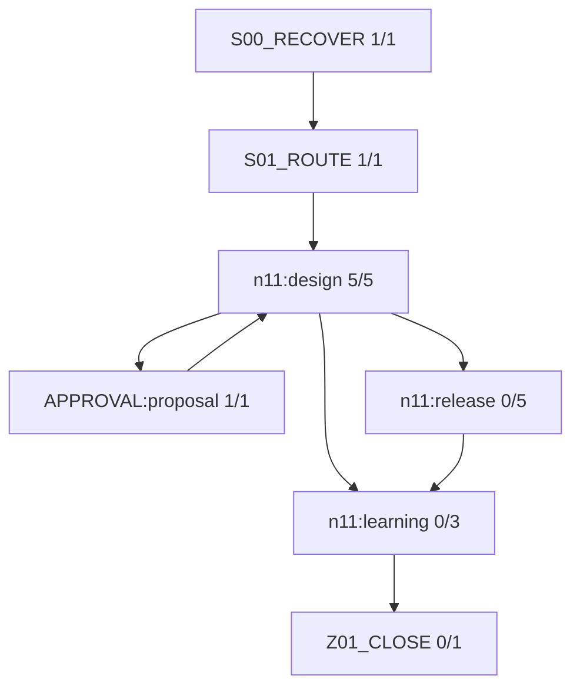

# 全体火柴図（GENERATED）

台帳HEAD: `4af8472b75e1a874cb299d0f162e867b6ff2c6a0499a9aab1eb03a0bd3b0f961`

```mermaid
flowchart TD
  N0["S00_RECOVER 1/1"]
  N1["S01_ROUTE 1/1"]
  N2["n11:design 5/5"]
  N3["APPROVAL:proposal 1/1"]
  N4["n11:release 0/5"]
  N5["n11:learning 0/3"]
  N6["Z01_CLOSE 0/1"]
  N3 --> N2
  N0 --> N1
  N1 --> N2
  N2 --> N3
  N2 --> N5
  N2 --> N4
  N5 --> N6
  N4 --> N5
```

現在: R07_VERIFY@n11 / READY
保留・修正queue: 7
関連修正Work: —
差戻しは再分析・失効・子Workの台帳イベントで記録し、実行依存へ循環を入れない。
