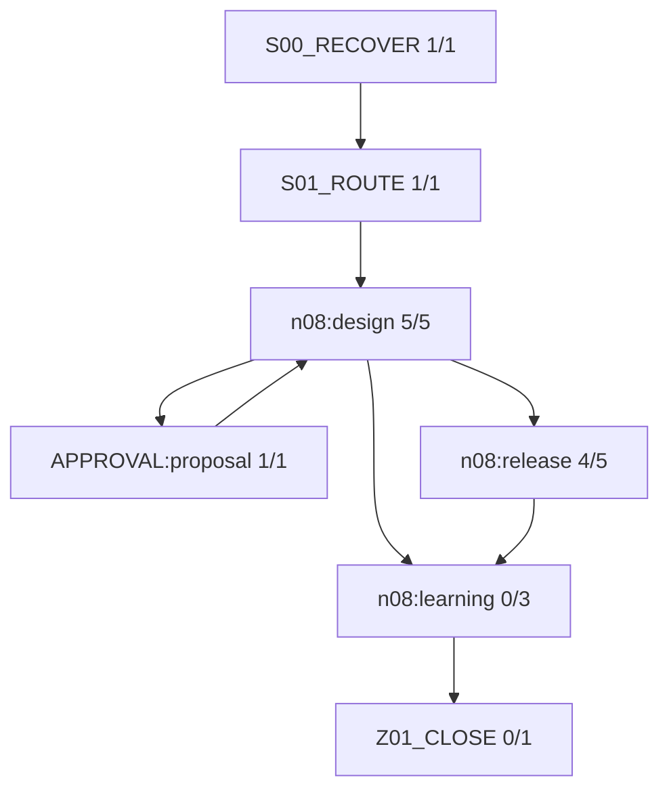

# 全体火柴図（GENERATED）

台帳HEAD: `cb870720eb851fe1f8dd1c33670e92046cb6786936e9597b0ffc03b426202c33`

```mermaid
flowchart TD
  N0["S00_RECOVER 1/1"]
  N1["S01_ROUTE 1/1"]
  N2["n08:design 5/5"]
  N3["APPROVAL:proposal 1/1"]
  N4["n08:release 4/5"]
  N5["n08:learning 0/3"]
  N6["Z01_CLOSE 0/1"]
  N3 --> N2
  N0 --> N1
  N1 --> N2
  N2 --> N3
  N2 --> N5
  N2 --> N4
  N5 --> N6
  N4 --> N5
```

現在: G3_FINAL@n08 / WAITING
保留・修正queue: 8
関連修正Work: —
差戻しは再分析・失効・子Workの台帳イベントで記録し、実行依存へ循環を入れない。
