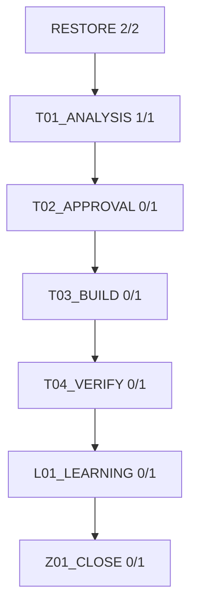

# 火柴図（GENERATED）

```mermaid
flowchart TD
  N0["RESTORE 2/2"]
  N1["T01_ANALYSIS 1/1"]
  N2["T02_APPROVAL 0/1"]
  N3["T03_BUILD 0/1"]
  N4["T04_VERIFY 0/1"]
  N5["L01_LEARNING 0/1"]
  N6["Z01_CLOSE 0/1"]
  N5 --> N6
  N0 --> N1
  N1 --> N2
  N2 --> N3
  N3 --> N4
  N4 --> N5
```

現在の経路: technical / 次ノード: T02_APPROVAL / WAITING

各ブロック内のノード・担当・失効・依存は CURRENT_POSITION.md と snapshot.json を参照。
